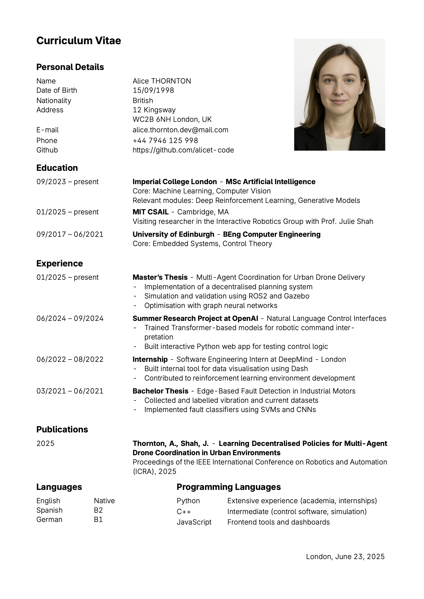

# Simple LaTeX CV Template - Usage Guide

<div align="center">
  
</div>

## :dash: Quick Start

1. Upload `cv.cls` into your Overleaf project or local LaTeX folder.  
2. Use `\documentclass{cv}` at the beginning of your `.tex` document.  

(optional) Add your profile picture as `picture.png` in the same directory.  

## :gear: Commands & Usage

### Sections

Use `\sectionStart{Title}` and `\sectionEnd` to structure your CV into clearly separated sections:

```latex
\sectionStart{Education}
  % Your entries here
\sectionEnd
```

### Entries within Sections

Each section typically contains entries defined as:

**Simple entry** — for concise key-value pairs:
  ```latex
  \entry{Label}{Detail}
  ```

**Paragraph entry** — for entries with descriptive text:
  ```latex
  \entryParagraph{Date}{Institution or Title}{Optional Location or Subtitle}{Description paragraph}
  ```

**List entry** — for entries with bullet points:
  ```latex
  \entryList{Date}{Institution or Title}{Optional Subtitle}{
    \item{First point}
    \item{Second point}
  }
  ```

### Split Sections

Use `\splitParagraph` for dual-column sections such as Languages and Skills:

```latex
\splitParagraph[0.4]{Left Column Title}{Right Column Title}{
  \entry{Label}{Text}
}{
  \entry{Label}{Text}
}
```

The optional `[0.4]` parameter sets the width of the left column.

### Adding a Photo

To automatically insert your profile photo:

```latex
\addPhoto
```

> Your image must be named `picture.png`.

### Other Parameters

Set location and date (footer):
  ```latex
  \setLocation{City or Place}
  \setDate{Date} % Optional — defaults to \today
  \addDate
  ```

Set document title (top of page):
  ```latex
  \setTitle{Your CV Title} % Optional — defaults to "Curriculum Vitae"
  ```

---

**Author: [Max KIEFFER](https://github.com/mkiefferus)**